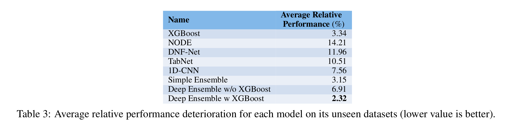
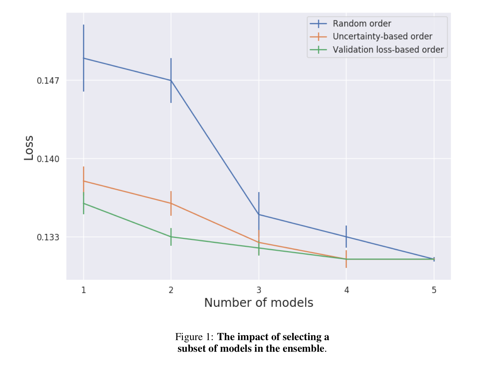
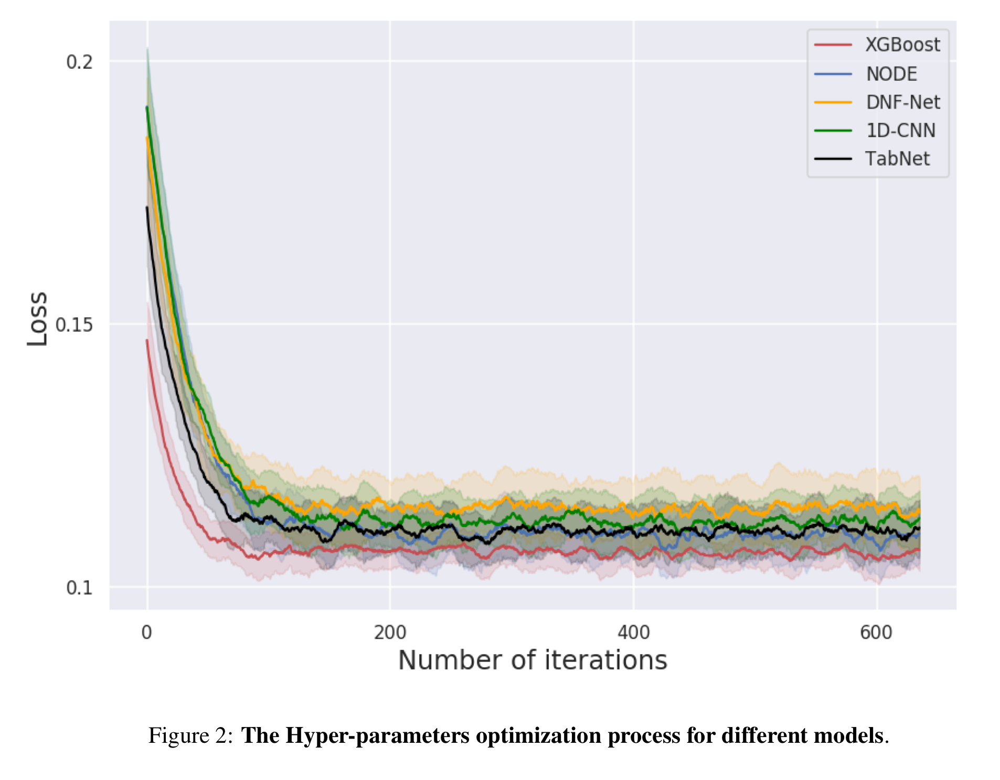

# Paper

[Tabular Data: Deep Learning is Not All You Need (2022)](https://arxiv.org/abs/2106.03253)

## 저자

- Ravid Shwartz-Ziv, Intel (NYU)

- Amitai Armon, Intel

# 1. Intrudoction

- 딥러닝의 이론적인 이점에도 불구하고, DNN이 tabular data에 적용될 때, 지역성(locality), data sparsity (missing values), mixed feature types (숫자, 숫서 및 범주형), 그리고 데이터셋 구조에 대한 사전 지식 부족 (text나 image 데이터와 다르게)과 같은 많은 문제를 제기합니다. 
- 최근에 tabular data에 대한 다양한 deep network 개발이 시도되었고, 그중 일부는 GBDT보다 성능이 우수하다고 주장하고 있습니다.하지만, GLUE와 같은 표준적인 벤치마크가 없고, tabular data model간 정확한 비교가 어려웠습니다. 
- Tabular data에 대한 딥러닝 연구가 증가하는 만큼, 이제 해당 분야에서의 최근 발전을 엄밀하게 리뷰할 시점이 되었습니다. 
- 본 연구의 목적은 최근 제안된 딥 모델중에서 Tabular data 문제에 있어 실제 추천되어야 하는 옵션이 있는지에 대해 탐구하고자 하는 것입니다. 
  - 해당 방법론을 제안한 논문에 등장하지 않은 데이터 셋에 대해서도 더 좋은 성능을 보이는가?
  - 학습시간, 하이퍼파라메터 서치에 있어 다른 모델과 비교했을 때 얼마나 시간이 걸리는가?
- 최근에 제안된 4개의 논문과 11개의 데이터셋을 고려했고, 그중 9개를 본 연구에서 활용하였습니다.

# 2. Background

## Tabular Data에서의 딥러닝

2개의 메인 카테고리가 존재합니다.

- Differentiable trees: 
  - DT를 미분 가능하게 만드는 방법을 찾는 것.
  - 기존 DT는 미분할 수 없어 gradient optimization이 불가능. => 내부 노드에서의 decision function을 스무딩해서 tree function과 tree rounting을 미분가능하게 만듬.
- Attention-based models:
  - tabular deep network에 attention과 같은 모듈을 도입함. 
  - 최근의 연구들은, 'inter-sample' attention (주어진 샘플 내 피쳐간 interaction)과 'intra-sample attention'(데이터 포인트간의 interaction)을 모두 제안하였음. 
  - 예시:
    - TabNet (Arik and Pfister, 2021)
    - Tabtransformer (Huang, 2020)
- Etc. 
  - Regularization method: 대규모 하이퍼파라미터 튜닝 방식을 사용하여 모든 신경 가중치(neural weight)에 대해 "regularization strength"를 학습 (??!!)
  - Multiplicative interaction에 대한 명시적인 모델링: 여러 가지 방식으로 feature product를 MLP 모델로 통합하고자 함. 
  - 1D-CNN: covolution의 이점을 tabular data에서 활용함. 

그러나, 앞서 언급했듯이 아직 벤치마크 데이터셋이 없어서 모델간 비교가 잘 되고 있지는 않습니다. 

## 비교 대상 모델

본 연구에서는 4개의 모델을 고려했습니다. 

- TabNet (Arik and Pfister, 2021) / Google
- NODE(Popov et al., 2020)
- DNF-Net (Katzir et al., 2021)
- 1D-CNN (Baosenguo, 2021)

### TabNet

(참고: https://lv99.tistory.com/83)

- Encoder가 존재하고, 인코더 안에서 시퀀셜한 결정단계가 sparse한 학습된 마스크를 사용하여 피쳐를 인코딩하고,
- 각 row별로 attention을 활용하여 유의미한 피쳐를 선택하게 됩니다. Sparsemax layer들을 활용해서 인코더는 작은 셋의 피쳐들을 선택하게 됩니다.
  - TabNet Encoder가 Feature Engineering효과를 내고, decision making 부분을 통해 feature selection이 이루어짐.
  - Sequential Attention을 사용하여 각 의사 결정 단계에서 추론할 피쳐를 선택하여 학습 능력이 가장 두드러진 피쳐에 사용되므로, interpretability와 효과적인 학습을 가능하게 함. 
  - 

- Learning mask의 장점은 피쳐가 all-or-nothing이 아니라는 것입니다. feature에 대한 hard threshold를 사용하기 보다, learnable mask는 soft decision을 할 수 있게 만들어서, 기존의 미분이 불가능한 피쳐 셀렉션 방식을 완화시키게 됩니다. 
- 모델 아키텍쳐
  - 
  - 

### Neural Oblivious Decision Ensembles (NODE)

참고: https://deep-and-shallow.com/2021/02/25/neural-oblivious-decision-ensemblesnode-a-state-of-the-art-deep-learning-algorithm-for-tabular-data/

- NODE 네트워크는 같은 depth의 Oblivious Decision Tree를 포함합니다. ODT들은 미분이 가능하여 error gradient 들이 backpropagate 가능합니다. 

  - ODT도 전통적인 Decision Tree와 마찬가지로 선택된 피쳐에 대해 데이터를 split하고, 각 피쳐를 학습된 threshold와 비교합니다. 
  - 그러나, 각 레벨에서 '단 하나'의 피쳐만 선택되어서, 그 결과로 미분 가능한 균형잡힌 ODT가 됩니다. 
  - 완성된 모형은 미분 가능한 트리들의 앙상블이 됩니다. 

- Decision Tree를 어떻게 미분가능하게 만들 수 있을까요?

  - 일반적인 DT는 다음과 같습니다. 

    

    - 여기에서 leaf node는 class label에 대한 분포 이므로, 이를 sigmoid나 softmax activation으로 대체할 수 있을 것입니다. -> 이것은 미분 가능합니다. 
    - Decision node를 살펴봅니다. Decision node의 목적은, 샘플을 left나 right로 라우팅시킬 건지에 대한 의사결정을 합니다. 이러한 decision들을 $d_{i}$와 $\bar{d}_{i}$ 라고 부릅시다. 이와 같은 의사결정을 위해, 특정 피쳐 (f)와 threshold(b)를 활용합니다. 이것이 노드의 파라미터 입니다. 
    - 전통적인 DT에서는 이러한 의사결정이 binary decision 입니다; right or left, 0 or 1인 것이죠.   -> 이것도 마찬가지로 Simoid function으로 대체할 수 있지 않을까요? 
    - 이것이 Kontschider et al (Deep Neural Decision Forests, 2015) 에서 제안한 방법입니다. 
      - 만약 우리가 0-1의 엄밀한 의사결정을 sigmoid 함수를 가지고 확률적인 의사결정으로 변형한다면, 노드는 미분 가능하게 될 것입니다. 

  - 하나의 노드(decision or a leaft node)에서 작동하는 것을 살펴보았습니다. 이것을 확장해봅시다. 위의 그림에서 red path가 decision tree에서 하나의 path가 될 수 있습니다. 

    - 결정론적인 버전에서는, 특정 샘플이 해당 path로 가는지 못가는지만 결정이 됩니다. 
- 만약에 같은 프로세스를 확률적인 용어로 생각하게 된다면, 특정 샘플에서 해당 path로 갈 확률은 해당 패스에 들어가 있는 모든 노드에 있어서 1이 되어야 합니다. 해당 path의 마지막 leaf노드에 도달하기 위해서 말이죠. 
    - 확률론적인 패러다임에서 우리는 전체 path를 따라 샘플이 왼쪽이나 오른쪽으로가는 확률을 곱해서 leaf노드에 도달할 확률을 구할 수 있게 됩니다. 
  - 즉, 샘플이 표시된 leaf node에 도달하는 확률은, $d_1 * \bar{d}_2 * \bar{d}_5$가 됩니다. 
    

#### Neural Oblivious Trees

Oblivious Trees는 symmetric하게 자라는 Tree 입니다. 각 레벨에서 인스턴스들을 왼쪽이나 오른쪽으로 split할 때 같은 피쳐들이 책임을 가지게 됩니다. 대표적인 gradient boosting 방법인 CatBoost에서 oblivious tree들을 활용합니다. 

Oblivisou Tree들은 흥미로운 것이, Decision Table을 $2^d$ (d = depth of the tree) 개 셀로 줄일 수 있습니다. 이것이 모든 것을 단순하게 만들 수 있습니다. 

각각의 ODT들은, $2^d$개 중 하나의 아웃풋을 내게 됩니다. 이것은 d feature-threshold combination을 활용하게 되고, 이것이 ODT의 파라미터들입니다.

수학적으로 ODT는 아래와 같이 정의됩니다. 

 $h(x)=R\left[\mathbb{I}\left(f_{1}(x)-b_{1}\right), \ldots, \mathbb{I}\left(f_{d}(x)-b_{d}\right)\right]{\space} where{\space} \mathbb{I}{\space} = step {\space} function$

tree output을 미분 가능하게 하려면, splitting feature choice(f)와 threshold b를 활용한 비교연산을 continuous하게 바꾸어야 합니다. 

전통적인 Tree에서는, split을 하기 위한 feature choice가 결정적(deterministic)인 의사결정에 따릅니다. 그러나 미분가능성을 위해서는 조금 더 부드러운 접근이 필요합니다. 즉, `weighted sum of features`가 되어야 하며, 각각의 weight는 학습이 됩니다. 일반적으로 피쳐들에 대한 Softmax choice를 생각할 수 있습니다만, 우리는 보다 sparse한 feature selection을 원합니다. 그러한 효과를 위해서 NODE는 학습가능한 피쳐 셀렉션 matrix $F\in R^{d \times n}$에 $\alpha$-entmax transformation (Peters et al., 2019)(??)을 사용합니다. 

유사하게, Heaviside function (step function)도 two-class entmax로 완화(relax)시킬 수 있습니다. 다른 피쳐들이, 다른 스케일을 가질 수 있도록, entmax를 파라미터 $\tau$로 스케일 합니다. 

$c_i(x)=\sigma_{\alpha}(\frac{f_ix-b_i}{\tau_i})$, where $b_i$ and $\tau_i$ are learnable parameters for thresholds and scales respectively.

Tree는 $c_i$에 의해 두 개의 사이드를 가지게 되므로, $c_i$, $(1-c_i)$를 쌓아서, “choice” tensor $C$를 정의할 수 있다. 
as outer product of all the trees:

$C(x)=\left[\begin{array}{c}\left.c_{1}(x)\right) \\ 1-c_{1}(x)\end{array}\right] \otimes\left[\begin{array}{c}\left.c_{2}(x)\right) \\ 1-c_{2}(x)\end{array}\right] \otimes \ldots \otimes\left[\begin{array}{c}\left.c_{d}(x)\right) \\ 1-c_{d}(x)\end{array}\right]$

This gives us the choice weights, or intuitively the probabilities of each of the $2^{d}$ outputs, which is in the Response tensor. So now it reduced into a weighted sum of Response tensor, weighted by the Choice tensor.
$$
h(x)=\sum_{i_{i}, \ldots i_{d} \epsilon / 0,1{ }^{d}} R_{i_{i}, \ldots i_{d}} \cdot C i_{i}, \ldots i_{d}(x)
$$
The entire setup looks like the below diagram:

From the Paper [3] 

#### Neural Oblivious Decision Ensembles

The jump from an individual tree to a "forest" is pretty simple. If we have $m$ trees in the ensemble, the final output is the concatenation of $\mathrm{m}$ individual trees $\left[\hat{h_{1}}(x), \ldots, \hat{h_{m}}(x)\right]$

Going Deeper with NODE
In addition to developing the core module(NODE layer), they also propose a deep version, where we stack multiple NODE layers on top of each other, but with residual connections. The input features and the outputs of all previous layers are concatenated and fed into the next NODE Layer and so on. And finally, the final output from all the layers are averaged(similar to the RandomForest).

From the Paper [3]

### DNF-Net

DNF-Net의 아이디어는 disjunctive normal formulas (DNF)를 닙 뉴럴네트워크에서 시뮬레이션 하는 것입니다. 

저자들은 Boolean formula들을 부드러운, 미분가능한 버전으로 대체하는 방법을 제안합니다. 

DNF-Net의 핵심 피쳐는 DNNF(disjunctive normal neural form) 블록인데, 해당 블록은 (1) FC layer, (2) DNNF layer (formed by a sofit version of binary conjunctions over literal)로 구성이 됩니다. 완성된 모델은 이러한 DNNF들의 앙상블이 됩니다. 

### 1-D CNN

참고: https://github.com/baosenguo/Kaggle-MoA-2nd-Place-Solution/blob/main/2nd%20Place%20Solution.pdf

최근에, 캐글에서 Tabular data에 대해 1-D CNN 모형이 가장 좋은 단일 모델 성능을 보인 바 있습니다 ([Baosenguo, 2021](https://github.com/baosenguo/Kaggle-MoA-2nd-Place-Solution)). 이 모델은 CNN구조가 ‘feature extraction’에 좋은 성능을 보인다는 아이디어에 기반한 것이었습니다. 여전히 tabular data에서 CNN은 거의 활용되지 않습니다. 왜냐하면 피쳐들의 순서가 locality특성을 가지지 않기 때문입니다. 

이 모델에서는, FC Layer가 locality characteristic을 가지는 큰 사이즈의 피쳐를 만드는 데에 사용이 됩니다. 그리고, 여러 개의 1D-Conv layer들이 shorcut-like connection과 함께 따라오게 됩니다. 

## 2.2 Model Ensemble

앙상블 학습은 성능을 향상시키고 분산을 줄이는 방법론으로 잘 알려져있습니다. 여러 개의 모델을 학습시키고, 그들의 결과를 결합하는 것입니다. 

앙상블 학습은, 다른 머신러닝 방법론들이 각기 다른 상황에서 더 성능이 좋거나, 실수를 한다는 가정을 전제하고 있습니다. 

앙상블 학습은 대개 두 개의 메인 타입으로 분류가 됩니다. 

1. Randomization에 기반한 테크닉
   - Random Forest를 그 예로 들 수 있습니다. - 각각의 앙상블 멤버들은 서로 다른 초기 파라미터 설정과 학습 데이터를 가지고 있습니다. 
   - 베이스 러너들은 서로간의 상호작용없이 동시 다발적으로 학습이 가능합니다. 
2. Boosting-based 방법론
   - 베이스 러너들이 연속적으로 (Sequentially) 학습되면서 모델을 적합 시키게 됩니다. 

대부분의 앙상블에서 Decision Tree가 베이스 러너로 활용이 됩니다. 

본 연구에서는 앙상블에 5개 분류기를 포함시켰음: TabNet, NODE, DNF-Net, 1D-CNN, XGBoost

실용적이고 직관적인 앙상블을 구축하기 위해, 두 가지 다른 버전을 제안하였습니다.

	- (1) 각 분류기를 동일한 weight로 취급
	- (2) 각 분류기에서 나온 예측들에 대해 가중 평균을 취함. 

데이터가 많을 수록 일반적으로 성능이 좋기 때문에, 각 모델을 학습 시킬 때에도 전체 학습 데이터를 활용하였습니다.

# 3. Comparing the Models

실제 적용을 위해서 모델은 반드시 (1) 정확하게 작동해야 합니다. (2) 학습과 추론이 효율적이어야 합니다. (3) 최적화(Optimization) 시간이 짧아야 합니다. (빠른 하이퍼파라미터 튜닝)

## 3.1 Experimental Setup

### 3.1.1 Data-sets Description

실험에는 11개의 Tabular dataset을 사용하였습니다. 데이터셋은 다양한 분류와 회귀 문제를 포함합니다. 데이터셋은 10개에서 2,000개의 피쳐를 포함하고, 1개에서 7개의 클래스, 7천개에서 백만 개의 샘플을 포함합니다. 

추가적으로, 수치형 / 범주형 피쳐의 갯수도 데이터 셋에 따라 상이합니다. 

TabNet, DNF-Net, NODE 페이퍼에서 사용된 9개의 데이터셋 (각 논문당 3개의 데이터셋)을 사용하였고, 아무 논문에서도 사용하지 않은 2개의 캐글 데이터셋을 추가하였습니다. 각각의 데이터셋은 원 논문과 같은 방법으로 전처리 / 학습되었습니다. 데이터는 zero mean and unit variance로 표준화  되었고, standardization의 통계량은 학습 데이터 기반해 계산되었다고 합니다. 

### 3.1.2 Implementation Details

#### The Optimization Process

Model의 하이퍼파라미터를 선택하기 위해 Bayesian Optimization을 사용하는 HyperOpt를 활용했습니다. 하이퍼파라미터 서치는 데이터셋별로 validation set에 대한 결과를 최적화하기 위해 1,000 스텝 수행하였습니다. 최초의 하이퍼파라미터는 원 논문에서 가져왔습니다. 각 모델은 6-9개의 핵심 하이퍼파라미터가 존재했습니다. 딥러닝 모델의 경우 learning rate, layer 수, node 수를 포함합니다.

데이터셋은 training, validation, test셋으로 원 논문에서와 같은 방식으로 나누었습니다. 

#### Metrics and evaluation

2진 분류 문제에 있어서, cross-entroy loss를 기록하였습니다. 회귀 문제에 있어서는 RMSE(Root Mean Square Error)를 측정하였습니다. 각각의 튜닝된 설정에 대해 4개의 다른 랜덤 시드를 활용해 실험하였고, 성능은 테스트셋에 대해 측정되었습니다. 

#### Statistical significance test

모델 성능 측정을 위해 RMSE 또는 cross-entropy loss 활용에 더하여, 모델간 차이가 통계적으로 유의미한지 평가하는 과정이 필요합니다. Friedman의 테스트(Friedman’s test)는 통계적 유의성을 평가하기 위해 널리 쓰이는 비모수적 방법론입니다. 이 방법의 장점은, 각 그룹의 데이터가 normal 분포를 따른다는 가정을 하지 않는 것입니다. 통계적으로 유의미하게 차이가 있는지 살펴보기 위해 프리드만 테스트를 활용해서, 다른 모델들의 에러를 비교하였습니다. 

omnibus(?) Friedman test를 적용하고 나서, 전체 분류기에 대해 서로서로 혹은, 베이스라인 분류기에 대한 비교를 수행하였습니다. 95% 신뢰수준으로 진행하였습니다.

#### Training

Classification 데이터셋에 대해, 우리는 cross-entropy loss를 최소화 시킵니다. 회귀 데이터셋에 있어서는, MSE(Mean Squred Error)를 최소화하고 관찰하게 됩니다. 

deep model에 있어서는 원 논문에서의 implementation을 따랐고, learning rate schedule없이 Adam Optimizer를 사용하였습니다. 각 데이터셋에 있어, 모든 모델에 있어 배치 사이즈도 최적화 하였습니다. 

validation 셋에 대해, 100번의 연속적인 epoch 에서 성능 향상 없을 때까지 학습을 진행하였습니다. 

## 3.2 Results

### Do the deep models generalize well to other datasets? 

과연 딥 모델이 다른 데이터셋에 대해서도 잘 일반화했을까요?

원 논문에 포함되지 않은 다른 데이터셋에서도 좋은 성능을 내는지를 탐색하였고 XGBoost와도 비교하였습니다. 

Table 2(위)는 데이터셋별 성능의 평균과 평균에 대한 standard error를 나타내고 있습니다. (값이 낮을 수록 좋은 성능을 의미합니다)

앞서 언급한 바와 같이 susceptibility(?) model 간의 통계적으로 유의한 차이를 확인하기 위해 95% 유의수준의 프리드만 검정을 수행하였습니다. 

위의 결과로부터 몇 가지 관찰을 할 수 있었습니다. 

- 대부분의 케이스에서, 모델들은 보지 못한 데이터에 대해 낮은 성능을 보였습니다. 
- XGBoost 모델은 일반적으로 deep model들의 성능을 능가했습니다. 11개의 데이터셋 중 8개의 데이터에서 XGBoost가 deep model들의 성능을 능가했습니다. 이러한 데이터셋에 대해서 결과는 유의미했습니다. (p<0.005)
- 일관성있게 다른 모델들보다 우위에 있는 deep model은 없었습니다. 각각의 deep model은 각 모델에 대한 원 논문에 포함된 데이터셋에서만 좋은 성능을 보였습니다. 
- 대부분의 경우에 deep model과 XGBoost의 앙상블이 성능 우위를 보였습니다. 11개중 7개의 데이터셋에서 deep model과 XGBoost의 앙상블이 하나의 deep model 보다 유의미하게 좋은 성능을 보였습니다. 

직접적으로 모델을 비교하기 위해서, 각각의 데이터셋에 대해 best model 대비해서의 상대적인 성능(성능이 떨어지는 정도)을 계산하였습니다. 

각 모델에 대해서 보지 않은 데이터셋에 대한 상대적 성능 비교 결과를 보면, 모든 모델에 대한 앙상블이 가장 높은 성능을 보임을 확인할 수 있습니다. 

위의 결과는 놀랍습니다. Deep model의 원 논문에서 보지 못한 데이터 셋에 대해서는, deep model이 XGBoost보다 낮은 성능을 보이고 있습니다. 이러한 결과에는 몇 가지 이유가 있는 것으로 보입니다. 

1. 먼저 selection bias의 가능성이 존재합니다. 
   - 각각의 논문은 자연스럽게 모델이 잘 작동하는 특정 데이터셋에서의 모델 성능을 나타내고 있을 수 있습니다. 
2. 두 번째 가능성은, 하이퍼파라미터 최적화(optimization)에 있어서의 다른 점들일 수 있습니다. 
   - 각 논문은 모델의 하이퍼파라미터를 논문에 나타난 데이터셋에서 더 광범위하게 서치했을 수 있습니다. 그것이 더 좋은 결과로 나타날 수 있습니다. 

### Do we need both XGBoost and deep networks?

여러 데이터셋에 걸쳐서, XGBoost 와 딥모델의 앙상블이 가장 좋은 성능을 보인 것으로 나타났습니다. 앙상블의 어떤 컴포넌트가 필수적인지에 대해 확인해보고자 합니다. 

XGBoost와 nondeep model (SVM, CatBoost)와의 앙상블을 학습시켰습니다. table [[2]](https://hwyum.github.io/ml%20papers/Tabular-Data-Deep-Learning-is-Not-All-You-Need-(2022)/#do-the-deep-models-generalize-well-to-other-datasets)를 살펴 보면, 클래식 모델들 간의 앙상블이, deep network와 XGBoost와의 앙상블보다 성능이 낮은 것을 알 수 있습니다. 또한, XGBoost를 제외한 deep model로만 구성된 앙상블의 성능도 좋지 않습니다. 이로부터 deep model과 XGBoost의 앙상블이 여러 데이터셋에서 성능 우위를 보위고 있음을 알 수 있습니다. 

### Subset of models

실제 적용시, 여러 모델을 활용하게 되면 추가적인 연산이 필요합니다. 따라서, 앙상블에 속한 모델들의 subset을 고려했을 때 performance와 computation간의 어떤 tradeoff가 있는지를 조사해보았습니다. 

subset을 선택하는 데에는 아래와 같이 여러 방법이 있을 수 있습니다. 

​	(1) validation loss에 기반해, validation loss가 낮은 모델을 먼저 선택함. 

​	(2) 모델별로 각 example에 대한 불확실성에 기반해, 가장 신뢰도가 높은 모델을 선택함. (어떤 종류의 불확실성 메저가 필요함.)

​	(3) Random한 순서에 기반함.

Figure 1을 살펴보면, 이러한 모델 선택 방법들을 보지 못한 데이터셋(Shrutime)에 대해서 비교되어 있습니다. 가장 좋은 선택 방법은 모델의 validation loss에 기반한 방법이었습니다. 이러한 방법으로 optimal한 성능을 얻는 데에 있어 단 3개의 모델이 필요하였습니다. 

### How difficult is the optimization?

현실 세계에서는 새로운 데이터셋에 대해 모델을 학습시키고 하이퍼파라미터 튜닝을 하는데 있어 시간과 자원에 제한이 있습니다. 따라서 각각의 모델에 대해 이러한 부분이 얼마나 어려운지에 대해 관심이 있을 것입니다. 이 부분을 측정하는 하나의 방법은, 각 모델이 필요로하는 연산의 수 (# of computations)를 계산하는 것입니다. 이것은 일반적으로 FLOPS (floting-point operations per second)로 측정 됩니다. 

Tang et al. (2018)dms FLOPS 수가 파라미터 수보다 에너지 사용과 대기 시간(latency) 측정에 좋은 indicator라고 제안하였습니다. 하지만 각각의 하이퍼파라메터 셋팅이 다른 FLOPS수를 가지고 있어서, 하이퍼파라미터 최적화에 있어 이 방법으로 다른 모델을 비교하는 것은 불가능합니다. 

다른 방법으로는, 모델 학습 및 최적화에 소요되는 시간을 비교하는 것입니다. 일반적으로 XGBoost가 유의미하게 deep network보다 빠르다는 것을 확인할 수 있었습니다. 하지만, runtime에서의 차이점은 software의 최적화 수준에 영향을 많이 받습니다. 

다른 방법으로는 하이퍼파라미터 최적화 프로세스가 plateau에 도달할 때까지의 iteration 수를 비교하는 것입니다.이것은 모델 고유의 특성을 나타내는 것으로 software optimization에 의존적이지 않습니다. 

Figure 2은 Shrutime dataset에 대해 모델의 하이퍼파라미터 최적화 프로세스에서의 iternation 수의 함수로 모델의 성능을 나타낸 것입니다. 

XGBoost가 Deep model들 대비 성능 우위에 있음을 확인했습니다. 즉, good performance로 더욱 빨리 수렴했습니다. 

이러한 결과는 여러 가지 요소에 영향을 받았을 수 있습니다. 

1. 우리는 **Bayesian hyperparameter optimization process**를 사용하였고, 다른 optimization process에 대해서는 결과가 다를 수 있습니다. 
2. XGBoost의 initial hyperparameter들이 더욱 Robust 할 수 있습니다. 왜냐하면, 더 많은 데이터셋들을 기반으로 셋팅된 값일 수 있기 때문입니다. Deep model에 대해서도 더 좋은 초기값을 발견하게 될 수도 있습니다. 
3. XGBoost모델이 더욱 robust하고 optimize가 쉬운 고유의 특성을 가지고 있을 수 있습니다. 

앞으로 더욱 연구되면 흥미로울 것입니다. 

# 4. Discussion and Conclusions

본 연구에 의하면, deep model은 원 논문에서 다루지 않은 데이터셋에 대해서는 XGBoost대비 낮은 성능을 나타냈습니다. 따라서, 우리는 deep model과 XGBoost의 앙상블을 제안합니다. 이러한 앙상블 모델이 어떠한 단독 모델보다, 그리고 classical 앙상블 모델 보다 높은 성능을 보여주었습니다. 

real-world application에서 중요한 또한 성능 vs. Computational inference cost 관점에서의 트레이드오프, 하이퍼파라미터 최적화 관점에서 탐구하였습니다. 우리의 연구는 deep model의 성능을 양념?(grain of salt) 정도로만 받아들여야 한다는 것을 보여주었습니다. 

추가적으로, 새로운 데이터셋에 있어 XGBoost 대비해서 deep model 들을 최적화 하는 것이 더 어렵습니다. 

그럼에도, 우리는 XGBoost와 deep model의 앙상블이 우리가 탐색한 데이터셋에 있어서는 가장 좋은 결과를 보여주었습니다. 

현실적으로, 시간 제약하에서 XGBoost가 가장 좋은 성능과 가장 쉬운 최적화를 얻을 수 있을 것입니다. 하지만 XGBoost모델 단독으로는 가장 좋은 성능을 얻기에 충분하지 않을 수 있습니다. 우리는 최고의 성능을 얻기 위해 앙상블 모델에 deep model을 추가하는 것이 필요할 수 있을 것입니다. 

결론적으로, tabular datad에 대한 deep model의 유의미한 진전에도 불구하고, 우리가 탐색한 데이터에 한해서는 XGBoost를 능가하지 못하였습니다. 이 분야에 있어 추가적인 연구가 필요할 것입니다. 

새로운 deep model을 개발함에 있어, 최적화에 용이한 모델, XGBoost와 이러한 파라미터 관점에서 경쟁할 수 있는 모델 개발이 하나의 연구 방향이 되어야 할 것입니다. 
